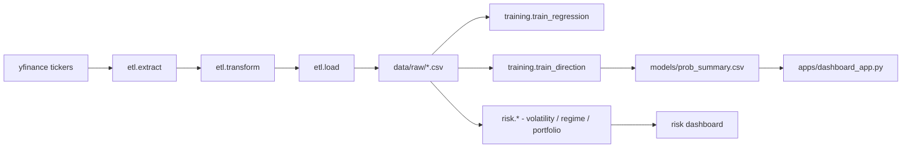

# 💹 AlphaQuant · ETL → ML/Statistical Models → Risk Analytics


[](https://www.python.org/)
[](https://pandas.pydata.org/)
[](https://scikit-learn.org/)
[](https://streamlit.io/)

**AlphaQuant** is an end-to-end financial data pipeline: it extracts and transforms OHLCV time series, engineers technical indicators, trains ensemble models, and produces quantitative signals with KPIs and interactive dashboards.

> Data source: **Yahoo Finance** via `yfinance`.
> **Author**: Carlos Andrés Orozco Caicedo 🇨🇴

---

## 🎯 Project direction

This project intentionally does **not** center itself on "predict if a stock goes up or down" — binary direction prediction on daily bars is a well-known low-signal problem in efficient markets, and accuracy alone is a misleading metric (a model can be "right" on small moves and catastrophically wrong on large ones).

Instead, AlphaQuant is evolving toward a **risk-analytics-first** design:

- ✅ **ETL + feature engineering** (implemented) — robust, idempotent, tested.
- ✅ **ML/statistical model zoo** (implemented) — regression + directional classifier, kept as a *secondary tactical signal*, not the core deliverable.
- 🚧 **Risk analytics module** (`alphaquant.risk`, in progress) — volatility forecasting (GARCH), market regime detection (clustering/HMM), and portfolio-level analytics (rolling correlation, VaR/CVaR, drawdown). This is where the project's real differentiation lives.

## 🏗️ Architecture

```
src/alphaquant/
├── etl/          extract (yfinance) → transform (indicators, cleaning) → load (idempotent CSV)
├── features/      technical indicators (SMA/EMA/RSI/MACD/Bollinger/ATR/lags) — single source of truth
├── models/        model zoo (linreg, ridge, lasso, RF, SVR, XGBoost, ARIMA/SARIMAX), CV, metrics
├── training/       train_regression.py, train_direction.py, tune.py (Optuna)
├── backtest/      signal backtesting, Sharpe/drawdown, CI sanity check
├── risk/          🚧 volatility / regime / portfolio analytics (Fase 4)
├── cli/           entrypoint (`alphaquant.cli.menu`)
└── utils/         config, logging, log rotation, global seed
```



---

## ⚙️ Install & Run

```bash
git clone https://github.com/ShadowBlack33/AlphaQuant.git
cd AlphaQuant

python -m venv .venv
source .venv/bin/activate        # Windows: .venv\Scripts\activate

pip install -e .                 # installs the alphaquant package + core deps
# optional, for models/tune.py:
pip install -r requirements-tuning.txt

alphaquant                       # runs the full pipeline (ETL -> train -> predict)
# equivalent to: python -m alphaquant.cli.menu

python scripts/plot_heatmap.py   # generate probability heatmap preview
streamlit run apps/dashboard_app.py
```

## 🧾 Configuration (`config/config.yaml`)

```yaml
start_date: "2015-01-01"
end_date: ""
interval: "1d"
data_dir: "data/raw"
default_top_n: 10
seed: 42
features:
  rsi_windows: [14]
  macd: { fast: 12, slow: 26, signal: 9 }
  sma_windows: [10, 20, 50, 200]
  ema_windows: [12, 26]
  bollinger: { window: 20, k: 2 }
  atr_window: 14
```

The `seed` is now wired end-to-end into every model's `random_state` (previously it was defined in config but never actually used).

---

## 🔁 Reproducibility & CI

- `pip install -e ".[dev]"` + `pytest -q` runs the **full** test suite (ETL, dedup, transform shape, and smoke tests) — previously CI only ran the smoke test.
- `python -m alphaquant.backtest.backtest_ci` is a deterministic sanity check with an **active** accuracy gate (`BACKTEST_CI_MIN_ACCURACY`, default 0.60) — previously this threshold check existed but was commented out, so CI could never fail on a quality regression.

---

## 🛠️ Troubleshooting

| Issue | Suggestion |
|---|---|
| `ModuleNotFoundError: alphaquant` | Run `pip install -e .` from the repo root first |
| Dashboard error | Run the full pipeline (`alphaquant`) before launching Streamlit |
| `tune.py` fails without optuna | Install `requirements-tuning.txt` |
| yfinance download fails | Retry or reduce ticker count / date range |

---

## 📜 License & Disclaimer

**MIT License © 2025 – Carlos Andrés Orozco Caicedo**

> Educational / experimental project. Not financial advice.

## 👤 Author

**Carlos Andrés Orozco Caicedo** — Data Engineering & Machine Learning · Colombia 🇨🇴
