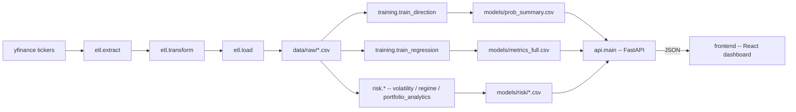

# 💹 AlphaQuant · ETL → Risk Analytics → Dashboard


[](https://www.python.org/)
[](https://pandas.pydata.org/)
[](https://scikit-learn.org/)
[](https://fastapi.tiangolo.com/)
[](https://react.dev/)
[](https://vitejs.dev/)

**AlphaQuant** is an end-to-end financial risk-analytics platform: it extracts and transforms OHLCV time series, engineers technical indicators, forecasts volatility and detects market regimes, computes portfolio risk (VaR/CVaR/drawdown), and serves it all through a FastAPI backend and a React dashboard — instead of scrolling through CMD output.

> Data source: **Yahoo Finance** via `yfinance`.
> **Author**: Carlos Andrés Orozco Caicedo — Data Engineer & AI Engineer 🇨🇴

---

## 🎯 Project direction

This project intentionally does **not** center itself on "predict if a stock goes up or down" — binary direction prediction on daily bars is a well-known low-signal problem in efficient markets, and accuracy alone is a misleading metric (a model can be "right" on small moves and catastrophically wrong on large ones).

Instead, AlphaQuant is a **risk-analytics-first** platform:

- ✅ **ETL + feature engineering** — robust, idempotent, tested.
- ✅ **ML/statistical model zoo** — regression + directional classifier, kept as a *secondary tactical signal*, not the core deliverable.
- ✅ **Risk analytics** (`alphaquant.risk`) — GARCH volatility forecasting, market regime detection (KMeans, optional HMM), and portfolio-level analytics (rolling correlation, VaR/CVaR, drawdown/Sharpe/Calmar conditioned on regime). This is where the project's real differentiation lives.
- ✅ **API + dashboard** — a read-only FastAPI backend exposes the pipeline's outputs as JSON; a React frontend renders them as an actual risk terminal, not a template.

## 🏗️ Architecture

```
src/alphaquant/
├── etl/          extract (yfinance) → transform (indicators, cleaning) → load (idempotent CSV)
├── features/      technical indicators (SMA/EMA/RSI/MACD/Bollinger/ATR/lags) — single source of truth
├── models/        model zoo (linreg, ridge, lasso, RF, SVR, XGBoost, ARIMA/SARIMAX), CV, metrics
├── training/       train_regression.py, train_direction.py, tune.py (Optuna)
├── backtest/      signal backtesting, Sharpe/drawdown, CI sanity check
├── risk/          volatility.py (GARCH), regime.py (KMeans/HMM), portfolio_analytics.py (VaR/CVaR/drawdown by regime)
├── api/           read-only FastAPI backend over data/raw, models/, models/risk/
├── cli/           entrypoint (`alphaquant.cli.menu`)
└── utils/         config, logging, log rotation, global seed

frontend/          React + Vite dashboard consuming the API above (see below)
```



---

## ⚙️ Install & Run

### 1. Pipeline (ETL → training → risk analytics)

```bash
git clone https://github.com/ShadowBlack33/AlphaQuant.git
cd AlphaQuant

python -m venv .venv
source .venv/bin/activate        # Windows: .venv\Scripts\activate

pip install -e ".[dev]"          # core package + pytest
# optional extras:
pip install -e ".[tuning]"       # Optuna + XGBoost, for models/tune.py
pip install -e ".[regime]"       # hmmlearn, for HMM-based regime detection

python -m alphaquant.cli.menu    # runs the full pipeline: ETL -> train -> risk analytics
```

> On Windows machines with an Application Control / AppLocker policy blocking direct `.exe` execution, use `python -m pip ...` / `python -m pytest ...` instead of the bare executables.

Answer `s` (yes) at the "Ejecutar analisis de riesgo?" prompt to also populate `models/risk/` (GARCH, regimes, portfolio risk) — this is what the dashboard reads.

### 2. Backend API

```bash
pip install -e ".[api]"          # fastapi + uvicorn
uvicorn alphaquant.api.main:app --reload --port 8000
```

Run this from the repo root — the backend reads `data/raw/`, `models/`, and `models/risk/` **relative to its working directory**, the same convention `alphaquant.cli.menu` uses. If the pipeline hasn't produced a given file yet, the corresponding endpoint returns an empty result rather than an error.

### 3. Dashboard (frontend)

```bash
cd frontend
npm install
npm run dev
```

Open http://localhost:5173. Environment variable `VITE_API_URL` (in `frontend/.env`) points at the backend, defaults to `http://localhost:8000`.

```bash
npm run build   # production build -> frontend/dist/, served separately from the API
```

---

## 🖥️ Dashboard: "Risk Desk"

A deliberate visual identity, not a dashboard template — the interface is built around the project's actual thesis (regime-aware risk) rather than decorating generic charts:

- **4 views**: Overview (portfolio KPIs + top signals), Volatility (GARCH per ticker), Regimes (regime timeline + time-in-regime), Portfolio Risk (rolling correlation, VaR/CVaR/drawdown by regime).
- **Regime tape**: a persistent ticker-tape strip under the header showing every ticker's current regime at a glance — visible before opening any tab.
- **No chart/UI framework**: a single dependency-free SVG chart component with a date/value hover tooltip, hand-written CSS — auditable, no black-box styling.
- **Type & color**: serif (*Newsreader*) for headers, monospace (*IBM Plex Mono*) tabular figures right-aligned like a real ledger, warm charcoal background, one disciplined copper/amber accent reserved for what needs attention.

```
frontend/src/
├── lib/            api.js (fetch client), format.js (%, decimal helpers)
├── components/     LineChart, RegimeTimeline, RegimeTape, StatCard, DataTable
├── pages/          Overview, Volatility, Regimes, PortfolioRisk
├── App.jsx         tab navigation + header + regime tape
└── index.css       "Risk Desk" design system
```

---

## 🧾 Configuration

### `config/config.yaml` (pipeline)

```yaml
start_date: "2015-01-01"
end_date: ""
interval: "1d"
data_dir: "data/raw"
default_top_n: 10
seed: 42
features:
  rsi_windows: [14]
  macd: { fast: 12, slow: 26, signal: 9 }
  sma_windows: [10, 20, 50, 200]
  ema_windows: [12, 26]
  bollinger: { window: 20, k: 2 }
  atr_window: 14
risk:
  enabled: true
  garch_p: 1
  garch_q: 1
  garch_horizon: 10
  n_regimes: 2
  roll_window: 21
  regime_method: "kmeans"
```

`seed` is wired end-to-end into every model's `random_state` (previously defined in config but never actually used).

### `frontend/.env` (dashboard)

```
VITE_API_URL=http://localhost:8000
```

---

## 🔁 Reproducibility & CI

- `pip install -e ".[dev]"` + `pytest -q` runs the **full** test suite (ETL, dedup, transform shape, GARCH, regime detection, portfolio analytics, API, and smoke tests) — previously CI only ran the smoke test.
- `python -m alphaquant.backtest.backtest_ci` is a deterministic sanity check with an **active** accuracy gate (`BACKTEST_CI_MIN_ACCURACY`, default 0.60) — previously this threshold check existed but was commented out, so CI could never fail on a quality regression.

---

## 🛠️ Troubleshooting

| Issue | Suggestion |
|---|---|
| `ModuleNotFoundError: alphaquant` | Run `pip install -e ".[dev]"` from the repo root first |
| `pip`/`pytest`/`uvicorn` "blocked by Application Control policy" (Windows) | Use `python -m pip ...` / `python -m pytest ...` / `python -m uvicorn ...` instead of the bare executable |
| Dashboard views say "No data yet" | Run `python -m alphaquant.cli.menu` with risk analytics enabled (`s` at that prompt) before starting the backend |
| CORS error in the browser console | Confirm the backend is running on port 8000 and `frontend/.env`'s `VITE_API_URL` matches it |
| `tune.py` fails without optuna | `pip install -e ".[tuning]"` |
| HMM regime detection unavailable | `pip install -e ".[regime]"` (KMeans works without it, no extra dependency needed) |
| yfinance download fails | Retry, or reduce ticker count / date range |
| `npm run build` fails | Confirm Node 18+; delete `frontend/node_modules` and re-run `npm install` |

---

## 📜 License & Disclaimer

**MIT License © 2025 – Carlos Andrés Orozco Caicedo**

> Educational / experimental project. Not financial advice.

## 👤 Author

**Carlos Andrés Orozco Caicedo** — Data Engineer & AI Engineer · Colombia 🇨🇴
